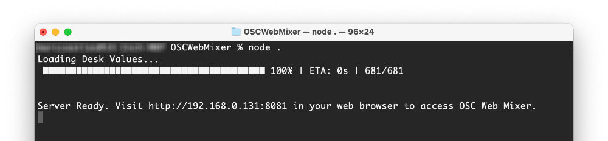

# OSCWebMixer
A server that allows multiple web clients to control their own mix for a DiGiCo sound desk. This has been tested with a SD9 console running 760 Firmware as well as with Stealth Core 2.

Users can save the website as a homescreen app which makes it easy for them to reconnect when needed. Users can also flag channels as favourites so they filter the display to see channels they are interested in.

There are no technical reasons why this wouldn't work with other sound desks that support OSC. It would just be a matter of adjusting the OSC address commands. Feel free to reach out if you are interested in this.

### Requirements
* An DiGiCo Mixing desk with the OSC extension installed and enabled.
* A computer to run the server. Windows and macOS work fine. There is no reason why linux wouldn't work.
* [Node](https://nodejs.org/en/download/) must be installed. On macOS you can install it with [Homebrew](https://brew.sh/) (brew install node)
* Server, Desk and other devices must all be on the same network

## Basic Setup Instructions
1. Download repository and navigate to the directory in a shell.
2. Run "npm install" to download all the required node modules.
3. Ensure OSC is enabled and configured under External Control on the sound desk.
4. Configure the server by editing config/default.js
5. Run "node ." in the shell to start the server. If a connection is made to the sound desk the script should load all the values and print the URL for other devices to connect to.
6. Open the IP address on another device and start mixing. 

## FAQs

  
My External Devices won't connect

  Ensure the server is running and the devices are connected on the same network. Also check the External Control is configured correctly in the desk.

  
What devices work?

  Anything with a recent web browser can connect, that means it should work on iOS, Android, Windows, macOS and Linux.

  
How many devices can I connect at once?

  No limit has been set and we haved tested 20+ without any issues.

  
Can I test it without a sound desk?

  Yes, add skip parameter when running the server. eg. "node . skip"

  
Can I view OSC messages from the desk?

  Yes, add debug parameter when running the server. eg. "node . debug"

  
Why haven't you use Web Workers?

  Web workers require HTTPS to be enabled and that would be too much mucking around to get it working on clients. Feel free to reach out if you can come up with a nice way for this to work.

## Donate
If you find this project useful why not make a donation to show your support?

